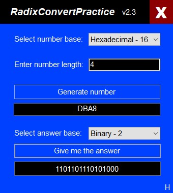
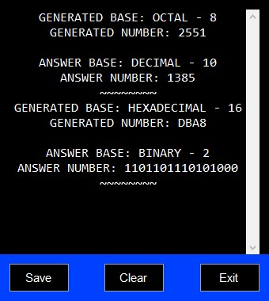

## About this program

I created this to help me generate random numbers in different number bases to convert to other number bases (classic bases included - such as binary (2), octal (8), decimal (10), and hexadecimal (16) bases).

It is a portable program (doesn't need to be installed) and it only needs [*dotnet framework 4 runtime*](https://dotnet.microsoft.com/en-us/download/dotnet-framework/thank-you/net40-offline-installer) as it's dependency.

[Click here to download the portable exe file, right away!](https://github.com/AliAlmasi/RadixConvertPractice/releases/latest/download/RadixConvertPractice.exe)

> "*dotnet framework 4 runtime*" offline installer (for both 32 & 64 bit systems) is included in this repo. [You can just click here to download, run `dotNetFx40_Full_x86_x64.exe` and install *dotnet framework 4 runtime*](https://github.com/AliAlmasi/RadixConvertPractice/releases/download/2.0.0.0/dotNetFx40_Full_x86_x64.exe).

[Link to git repository](https://github.com/alialmasi/radixconvertpractice.git)

## Screenshots
<table>
  <thead>
    <tr>
      <th>Main window's screenshot</th>
      <th>History window's screenshot</th>
    </tr>
  </thead>
  <tbody>
    <tr>
      <td></td>
      <td></td>
    </tr>
  </tbody>
</table>
